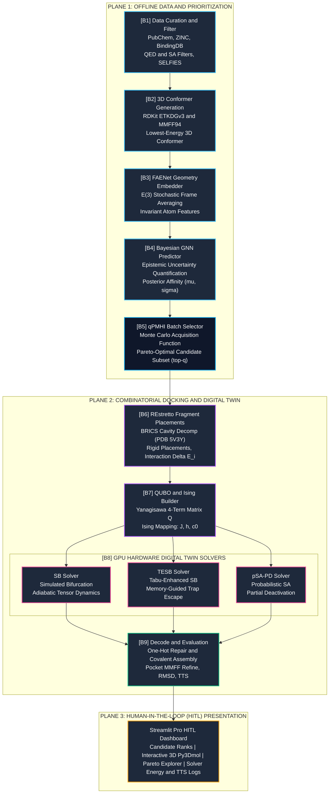
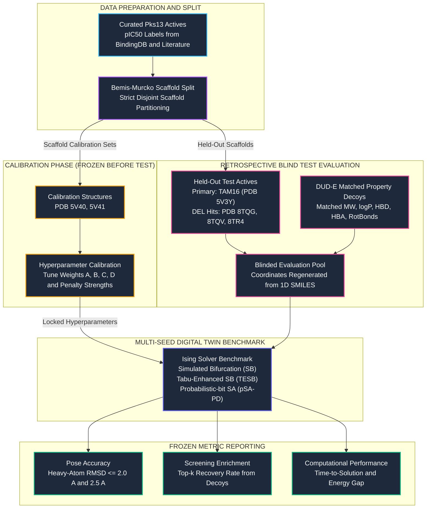

# X-TUBIT

**In-Silico Hardware Digital Twin & Decoupled CADD Pipeline for Screening *Mycobacterium tuberculosis* Pks13-TE Inhibitors**

[](https://www.python.org/)
[](https://pytorch.org/)
[](https://www.rdkit.org/)
[](LICENSE.txt)
[](docs/BLUEPRINT.md)

---

## Table of Contents

- [Overview](#overview)
- [Clinical and Scientific Background](#clinical-and-scientific-background)
  - [The Global and Indonesian MDR-TB Challenge](#the-global-and-indonesian-mdr-tb-challenge)
  - [Pks13-TE as an Essential Mycolic Acid Target](#pks13-te-as-an-essential-mycolic-acid-target)
  - [In-Silico Hardware Digital Twin Motivation](#in-silico-hardware-digital-twin-motivation)
- [Pipeline Architecture (Decoupled B1-B9)](#pipeline-architecture-decoupled-b1-b9)
  - [System Topology](#system-topology)
  - [Execution Domains](#execution-domains)
  - [Module Breakdown](#module-breakdown)
- [Mathematical Formulation](#mathematical-formulation)
  - [Fragment-Based Flexible Docking QUBO](#fragment-based-flexible-docking-qubo)
  - [Ising Hamiltonian Transformation](#ising-hamiltonian-transformation)
  - [Digital Twin Solvers: SB, TESB, and pSA-PD](#digital-twin-solvers-sb-tesb-and-psa-pd)
  - [Multi-Objective Acquisition via qPMHI](#multi-objective-acquisition-via-qpmhi)
- [Experimental Protocols and Benchmarking](#experimental-protocols-and-benchmarking)
  - [T0 Replication Benchmark](#t0-replication-benchmark)
  - [Pks13-TE Retrospective Blind Test Protocol](#pks13-te-retrospective-blind-test-protocol)
- [Repository Structure](#repository-structure)
- [Getting Started](#getting-started)
  - [1. Environment Setup](#1-environment-setup)
  - [2. Bootstrapping Third-Party Dependencies](#2-bootstrapping-third-party-dependencies)
  - [3. Running Tests and Verifications](#3-running-tests-and-verifications)
  - [4. Launching the Human-in-the-Loop Dashboard](#4-launching-the-human-in-the-loop-dashboard)
- [System Boundaries and Scientific Disclaimers](#system-boundaries-and-scientific-disclaimers)
- [Team and Acknowledgments](#team-and-acknowledgments)
- [Citation](#citation)
- [License](#license)
- [References](#references)

---

## Overview

**X-TUBIT** is a computer-aided drug design (CADD) pipeline and in-silico hardware emulator engineered to prioritize small-molecule inhibitors targeting the **Polyketide Synthase 13 Thioesterase (Pks13-TE)** domain of *Mycobacterium tuberculosis*.

Rather than relying on monolithic, opaque docking suites, X-TUBIT implements a **decoupled, auditable pipeline** connecting:
1. **Geometric Deep Learning**: E(3)-equivariant feature learning via Frame Averaging Equivariant Networks ([FAENet](https://arxiv.org/abs/2305.05577)) and Bayesian Graph Neural Networks ([BGNN](https://doi.org/10.1039/C9SC03844G)) for uncertainty-aware affinity prediction ($\mu, \sigma$).
2. **Multi-Objective Active Selection**: Batch Pareto hypervolume optimization using Probabilistic Maximum Hypervolume Improvement ([qPMHI](https://doi.org/10.1021/acs.iecr.5c04066)) bounded by chemical grammar robustness via [SELFIES](https://doi.org/10.1088/2632-2153/aba947), drug-likeness (QED), and synthetic accessibility (SA).
3. **In-Silico Hardware Digital Twin**: An Ising-model combinatorial optimization engine executing GPU-accelerated Simulated Bifurcation ([SB](https://doi.org/10.1126/sciadv.abe7953)), Tabu-Enhanced Simulated Bifurcation ([TESB](https://doi.org/10.1038/s42005-026-02052-1)), and stochastic probabilistic-bit Simulated Annealing with Partial Deactivation ([pSA-PD](https://doi.org/10.1038/s41598-024-51786-9)) to solve fragment-based flexible docking formulated as a Quadratic Unconstrained Binary Optimization (QUBO) problem.
4. **Human-in-the-Loop (HITL) Interface**: An interactive Streamlit dashboard allowing researchers to explore candidate rankings, 3D binding poses, solver energy trajectories, and Pareto frontiers.

*Note: For the original assembly build pack specification and engineering notes, refer to [README.old.md](README.old.md).*

---

## Clinical and Scientific Background

### The Global and Indonesian MDR-TB Challenge
Tuberculosis remains one of the leading causes of death from a single infectious agent worldwide. The escalation of **Multidrug-Resistant Tuberculosis (MDR-TB)** poses an acute challenge to global public health:
- **Indonesia's High Burden**: Indonesia accounts for approximately 10% of global tuberculosis cases, ranking **second globally** in total TB burden ([WHO, 2025a](https://www.who.int/teams/global-tuberculosis-programme/data)).
- **Diagnostic and Treatment Gap**: In 2022, WHO estimated 31,000 (18,000-43,000) individuals in Indonesia developed rifampicin-resistant/MDR-TB (RR/MDR-TB); however, only 11,833 were laboratory-confirmed and 7,745 initiated therapy. The 2020 second-line treatment cohort achieved a treatment success rate of merely **52%** ($n = 4,290$) ([WHO, 2023](https://www.who.int/teams/global-tuberculosis-programme/data)).
- **Emerging Resistance to Core Regimens**: Contemporary six-month regimens (BPaL/BPaLM) depend on bedaquiline; however, meta-analyses report bedaquiline resistance rates of **5.7%** (95% CI 3.6-8.3) among drug-resistant TB cohorts ([Hu et al., 2025](https://doi.org/10.1186/s12879-025-10889-4); [WHO, 2025b](https://www.who.int/publications/i/item/9789240090880)). Discovering inhibitor candidates directed at unexploited clinical targets is an urgent biomedical priority.

### Pks13-TE as an Essential Mycolic Acid Target
**Polyketide Synthase 13 (Pks13)** mediates the final condensation step in mycolic acid biosynthesis, an essential lipid constituent of the mycobacterial cell envelope ([Kim et al., 2023](https://doi.org/10.1038/s41594-023-00921-1)). Inhibition of its Thioesterase domain (**Pks13-TE**) blocks trehalose monomycolate formation and triggers rapid bacterial lysis:
- **Reference Lead TAM16**: A potent benzofuran-based Pks13-TE inhibitor crystallized in complex with Pks13-TE (**PDB [5V3Y](https://www.rcsb.org/structure/5V3Y)**) with nanomolar biochemical activity ([Aggarwal et al., 2017](https://doi.org/10.1016/j.cell.2017.06.025)).
- **DNA-Encoded Library (DEL) Scaffolds**: Recent DEL campaigns have identified diverse non-covalent thioesterase-binding chemotypes (**PDB [8TQG](https://www.rcsb.org/structure/8TQG)**, **[8TQV](https://www.rcsb.org/structure/8TQV)**, **[8TR4](https://www.rcsb.org/structure/8TR4)**; [Krieger et al., 2024](https://doi.org/10.1021/acsinfecdis.4c00032)).

### In-Silico Hardware Digital Twin Motivation
Rigid-body docking cannot represent entire ligand conformational degrees of freedom, while all-atom flexible docking suffers from combinatorial explosion ($2^N$ configuration space). Emerging non-von Neumann computing architectures, specifically **Ising machines** and physical **probabilistic bits (p-bits)** using stochastic Magnetic Tunnel Junctions (sMTJs), demonstrate promising convergence on combinatorial optimization problems ([Camsari et al., 2017](https://doi.org/10.1103/PhysRevX.7.031014)).

Because physical p-bit hardware requires specialized semiconductor fabrication, **X-TUBIT acts as an In-Silico Hardware Digital Twin**: a software emulator running on parallel GPU tensors that emulates Kerr-nonlinear parametric oscillator (KPO) and p-bit dynamics. This provides an auditable computational benchmark evaluating whether Ising-based combinatorial algorithms provide tangible advantages for molecular docking before investing in specialized hardware.

---

## Pipeline Architecture (Decoupled B1-B9)

### System Topology

The diagram below outlines the three execution planes of X-TUBIT. The color scheme uses high-contrast cards with distinct themed borders that remain clearly readable in both **Dark Mode** and **Light Mode**.



### Execution Domains

To ensure robust deployment across varied environments, the codebase isolates runtime concerns into four execution domains:

1. **`chem`**: Chemical informatics, conformer generation, BRICS fragmentation, and property descriptors (RDKit, MolVS).
2. **`ml`**: Deep learning and probabilistic inference (PyTorch, PyG, FAENet, Bayesian GNN, qPMHI).
3. **`opt`**: Tensor-based combinatorial optimization, Ising dynamics, and exact validation (PyTorch, OR-Tools).
4. **`ui`**: Presentation, 3D visualization, and artifact inspection (Streamlit).

All command-line interfaces use lazy imports so that dependencies in one domain do not impede work in another.

### Module Breakdown

| Block | Name | Input | Primary Tool / Model | Artifact Output | File Reference |
| :---: | :--- | :--- | :--- | :--- | :--- |
| **B1** | **Data Curation** | Raw SMILES, Bioactivity tables | RDKit, MolVS, SELFIES | Canonical SMILES, QED, SA scores, scaffold splits | [`b1_data.py`](src/xtubit/b1_data.py) |
| **B2** | **Conformer Gen** | Canonical SMILES | RDKit ETKDGv3, MMFF94 | 3D SDF coordinates, molecular adjacency graphs | [`b2_conformer.py`](src/xtubit/b2_conformer.py) |
| **B3** | **FAENet Embedding** | 3D Graph coordinates | PyTorch Geometric, FAENet | Invariant per-atom latent vectors ($E(3)$-averaged) | [`b3_faenet_adapter.py`](src/xtubit/b3_faenet_adapter.py) |
| **B4** | **Bayesian GNN** | FAENet embeddings + Graph | Monte Carlo Dropout / Bayes layers | Target affinity predictions $\mu$ and uncertainty $\sigma$ | [`b4_bayesian_gnn.py`](src/xtubit/b4_bayesian_gnn.py) |
| **B5** | **qPMHI Selection** | $\mu, \sigma$, QED, SA scores | Monte Carlo acquisition function | Pareto-optimal candidate batch ID subset | [`qpmhi.py`](src/xtubit/qpmhi.py) |
| **B6** | **Fragment Placements**| Ligand + Pks13-TE cavity | BRICS slicing, REstretto subregions | Placement records $\Delta E_i$, clashes $c_{ij}$, connectivity $b_{ij}$ | [`b6_pairs.py`](src/xtubit/b6_pairs.py) |
| **B7** | **QUBO / Ising Map** | Placement records, weights | PyTorch, NumPy | Symmetric matrix $Q \in \mathbb{R}^{N \times N}$ and Ising $(J, h, c_0)$ | [`b7_qubo.py`](src/xtubit/b7_qubo.py) |
| **B8** | **Digital Twin Solver**| Ising $(J, h)$ or QUBO $Q$ | PyTorch (SB, TESB, pSA-PD) | Binary spin solutions $s \in \{-1, +1\}^N$, minimum energy $E$ | [`solvers/`](src/xtubit/solvers/) |
| **B9** | **Decode & Refine** | Bitstrings, Variable Map, PDB | Constrained MMFF/UFF minimization | Assembled 3D pose, heavy-atom RMSD, TTS, valid ratio | [`b9_metrics.py`](src/xtubit/b9_metrics.py) |

---

## Mathematical Formulation

### Fragment-Based Flexible Docking QUBO
Following the discrete formulation by [Yanagisawa et al. (2024)](https://doi.org/10.3390/e26050397), the flexible docking problem is decomposed into $K$ fragments. Let $F_k$ denote the set of candidate rigid placements for fragment $k$, and $x_i \in \{0, 1\}$ be the binary variable indicating whether placement $i$ is selected:

$$\min_{x \in \{0,1\}^N} E(x) = A \sum_{i} \Delta E_i \, x_i + B \sum_{i < j} c_{ij} \, x_i x_j + C \sum_{i < j} b_{ij} \, x_i x_j + D \sum_{k=1}^K \left( \sum_{i \in F_k} x_i - 1 \right)^2$$

Where:
- $\Delta E_i$: Protein-fragment interaction binding energy for placement $i$.
- $c_{ij} \in \{0, 1\}$: Steric clash indicator ($c_{ij} = 1$ if placements $i$ and $j$ overlap within van der Waals radii threshold).
- $b_{ij}$: Fragment connectivity term. In **reward mode** (matching the Yanagisawa baseline), $b_{ij} = -1$ when two placements are joinable within distance tolerance and 0 otherwise. In **penalty mode** (matching the proposal notation), $b_{ij} \ge 0$ penalizes disconnected configurations. Both modes are configurable in [`configs/b7.yaml`](configs/b7.yaml).
- $\left(\sum_{i \in F_k} x_i - 1\right)^2$: Exact one-hot constraint ensuring exactly one placement is chosen per fragment.
- $A, B, C, D$: Energy balancing weights (calibrated on dedicated training complexes, default: $A=1, B=5, C=5, D=25$).

Expanding into canonical matrix form $E(x) = x^\top Q x + \text{const}$:
- Diagonal: $Q_{ii} = A \Delta E_i - D$
- Off-diagonal: $Q_{ij} = \frac{1}{2} (B c_{ij} + C b_{ij}) + D \cdot \mathbb{I}[i, j \in F_k]$

### Ising Hamiltonian Transformation
To map the problem onto physical or simulated Ising spins $s_i \in \{-1, +1\}$ via $x_i = \frac{s_i + 1}{2}$:

$$H_{\text{Ising}}(s) = -\frac{1}{2} s^\top J s - h^\top s + c_0$$

With exact algebraic conversions:
$$J = -\frac{1}{2} \left( Q - \operatorname{diag}(Q) \right)$$
$$h = -\frac{1}{2} Q \mathbf{1}$$
$$c_0 = \frac{1}{2} \operatorname{tr}(Q) + \frac{1}{2} \sum_{i < j} Q_{ij}$$

### Digital Twin Solvers: SB, TESB, and pSA-PD
1. **Simulated Bifurcation (SB)**: Solves non-convex Ising optimization via continuous nonlinear adiabatic bifurcation dynamics on coupled classical oscillators ([Goto et al., 2021](https://doi.org/10.1126/sciadv.abe7953)).
2. **Tabu-Enhanced Simulated Bifurcation (TESB)**: Supplements SB oscillator dynamics with memory-guided tabu penalties to destabilize previously visited local minima and accelerate escape from energetic traps ([Tao et al., 2026](https://doi.org/10.1038/s42005-026-02052-1)).
3. **Probabilistic-bit Simulated Annealing with Partial Deactivation (pSA-PD)**: Emulates networks of autonomous stochastic p-bits with dynamic sub-cluster deactivation (TApSA and SpSA variants) to overcome search stagnation ([Onizawa and Hanyu, 2024](https://doi.org/10.1038/s41598-024-51786-9)).

### Multi-Objective Acquisition via qPMHI
In the active pre-screening stage (B5), the candidate pool is evaluated across three objectives: predicted affinity ($f_1 = \mu$), drug-likeness ($f_2 = \text{QED}$), and synthetic accessibility ($f_3 = \text{SA}^{-1}$).

To prioritize molecules that maximize the Pareto frontier under epistemic uncertainty $\sigma$, the **Probabilistic Maximum Hypervolume Improvement (qPMHI)** score computes the Monte Carlo expectation of hypervolume contribution ([Muthyala et al., 2026](https://doi.org/10.1021/acs.iecr.5c04066)):

$$\alpha_{\text{qPMHI}}(x) = \mathbb{E}_{y \sim \mathcal{N}(\mu(x), \sigma^2(x))} \left[ \Delta \operatorname{HV}(y \cup \mathcal{P}_{\text{curr}}, \mathbf{r}) \right]$$

---

## Experimental Protocols and Benchmarking

### T0 Replication Benchmark
Before testing against Pks13-TE, the pipeline executes a validation benchmark against the published **Aldose Reductase** complex (**PDB [2HV5](https://www.rcsb.org/structure/2HV5)**; Yanagisawa et al., 2024):
1. Extract crystal ligand and pocket box ($20 \times 20 \times 20$ Å).
2. Fragment ligand into rigid units and discretize pocket into $2 \times 2 \times 2$ Å subregions.
3. Construct matrix $Q$ in reward mode with canonical weights $(A, B, C, D) = (1, 5, 5, 25)$.
4. Verify solver energy against the Zenodo reference dataset and confirm pose recovery before commencing Pks13 production runs.

### Pks13-TE Retrospective Blind Test Protocol
To guarantee methodological rigor and prevent data leakage, X-TUBIT adopts the **Retrospective Blind Test Protocol** ([docs/EXPERIMENT_PROTOCOL.md](docs/EXPERIMENT_PROTOCOL.md)):



*Blinding Rule: Hyperparameters ($A, B, C, D$, subregion grids, and solver penalty strengths) are strictly tuned on calibration complexes before blind testing. Pose coordinates are regenerated from 1D SMILES rather than crystal coordinates to eliminate conformation bias.*

---

## Repository Structure

```text
xtubit/
|-- app/
|   `-- streamlit_app.py        # Streamlit Human-in-the-Loop visualization dashboard
|-- configs/
|   |-- global.yaml             # Global paths, random seeds, and compute devices
|   `-- b1.yaml ... b9.yaml     # Per-block hyperparameter configs
|-- data/
|   |-- README.md               # Data storage policies and checksums
|   |-- raw/                    # Raw PDB structures and bioactivity manifests
|   |   |-- pdb_manifest.csv    # PDB IDs, chains, and ligand references
|   |   `-- seed_labels.csv     # Curated Pks13 bioactivity records
|   `-- schemas/                # Table schemas and column type definitions
|-- docs/
|   |-- ASSEMBLY_CHECKLIST.md   # Step-by-step assembly milestones
|   |-- BLUEPRINT.md            # Detailed architectural blueprint (v0.1)
|   |-- EXPERIMENT_PROTOCOL.md  # Formal experiment protocol and reporting standards
|   |-- INTERFACES.md           # API signatures between pipeline blocks
|   `-- SOURCE_FACT_MATRIX.md   # Traceability matrix mapping code to literature
|-- scripts/
|   |-- bootstrap_third_party.sh # Clones and pins external reference repositories
|   `-- env_check.py            # Environment validation script
|-- src/
|   `-- xtubit/
|       |-- __init__.py
|       |-- b1_data.py          # Curation, QED/SA filtering, SELFIES conversion
|       |-- b2_conformer.py     # RDKit ETKDGv3 conformer generation
|       |-- b3_faenet_adapter.py# FAENet frame averaging embedding adapter
|       |-- b4_bayesian_gnn.py  # Bayesian GNN affinity predictor with MC sampling
|       |-- qpmhi.py            # qPMHI Pareto hypervolume selection engine
|       |-- b6_pairs.py         # Subregion pair potentials and steric clashes
|       |-- b6_restretto.py     # REstretto fragment placement adapter
|       |-- b7_qubo.py          # Yanagisawa QUBO builder and Ising (J, h) mapping
|       |-- solvers/            # Digital Twin combinatorial solver implementations
|       |   |-- exact.py        # Exact branch-and-bound / brute-force baseline
|       |   |-- sb_adapter.py   # PyTorch Simulated Bifurcation adapter
|       |   |-- tesb_port.py    # Tabu-Enhanced Simulated Bifurcation solver
|       |   `-- psa_pd.py       # p-bit Simulated Annealing with Partial Deactivation
|       |-- b9_metrics.py       # Bitstring repair, assembly, RMSD and metrics
|       `-- common/             # Mathematical and tensor utilities
|-- tests/
|   |-- test_onehot_formula.py  # Tests one-hot constraint penalty expansion
|   `-- test_qubo_mapping.py    # Tests QUBO-to-Ising energy equivalence
|-- third_party/
|   |-- LICENSE_NOTES.md        # Licensing terms of external dependencies
|   |-- SOURCES.md              # Upstream repository URLs, roles, and commit hashes
|   `-- URLS.txt                # Direct remote links
|-- Makefile                    # Automation shortcuts (make test, make check)
|-- pyproject.toml              # Build specifications and dependencies
|-- README.old.md               # Archived initial build-pack readme
`-- README.md                   # This project guide
```

---

## Getting Started

### 1. Environment Setup

Ensure Python 3.10 or higher is installed with CUDA-compatible PyTorch:

```bash
# Clone the repository
git clone https://github.com/Camn0/xtubit.git
cd xtubit

# Create and activate virtual environment
python -m venv .venv
source .venv/bin/activate  # On Windows: .venv\Scripts\Activate.ps1

# Install package in editable mode with development dependencies
pip install -e .
```

Verify your local environment dependencies:
```bash
python scripts/env_check.py
```

### 2. Bootstrapping Third-Party Dependencies

X-TUBIT avoids vendoring third-party source trees directly. Instead, external reference implementations are cloned and checked out at pinned commits:

```bash
bash scripts/bootstrap_third_party.sh
```
Refer to [third_party/SOURCES.md](third_party/SOURCES.md) for full licensing and upstream repository metadata.

### 3. Running Tests and Verifications

Execute internal unit tests validating mathematical equivalence between QUBO and Ising formulations, constraint expansions, and solver sanity checks:

```bash
# Run test suite via pytest or Makefile
pytest -q tests
# or
make test
```

### 4. Launching the Human-in-the-Loop Dashboard

The Streamlit interface allows visual inspection of experimental artifacts:

```bash
streamlit run app/streamlit_app.py
```

---

## System Boundaries and Scientific Disclaimers

1. **Early-Stage In-Silico Screening Tool**: X-TUBIT is an in-silico hypothesis-generating accelerator designed to prioritize candidates for laboratory synthesis and assay. It is **not** a replacement for *in-vitro* enzymatic assays (e.g., Pks13 spectrophotometric thioesterase activity assays) or *in-vivo* minimum inhibitory concentration (MIC) determinations.
2. **Solver Comparison Scope**: Performance benchmarks (TTS, energy stability, seed variance) measure comparative differences **among Ising solvers** (Simulated Bifurcation vs. TESB vs. pSA-PD) to assess the utility of physics-inspired combinatorial optimization. No claims of unqualified superiority over established classical software (e.g., AutoDock Vina, Glide) are asserted without rigorous, like-for-like head-to-head empirical testing.
3. **Binding Pocket Assumption**: Fragment placements require a pre-defined pocket cavity. All docking experiments assume known crystallographic binding sites (e.g., the TAM16 binding channel in Pks13-TE).
4. **Generalization Boundaries**: Affinity predictions from the Bayesian GNN are bounded by the chemical diversity of the training set (scaffold splits documented in [`data/`](data/)). Extrapolations beyond this domain are accompanied by explicit epistemic uncertainty estimates ($\sigma$).

---

## Team and Acknowledgments

**Program**: Program Kreativitas Mahasiswa - Karsa Cipta (PKM-KC) 2026  
**Focus Area**: Healthcare and Public Health (*Kesehatan dan Gizi Masyarakat*)  
**Institution**: Institut Teknologi Bandung (ITB)

### Research Team
- **Maheztha Sulthan Syadi** ([@Camn0](https://github.com/Camn0)) - *Research Coordination, Multi-Objective BGNN/qPMHI Formulation, Cloud GPU Digital Twin Solvers (SB/TESB/pSA-PD), Retrospective Blind Test Supervision.*
- **Agit Prasetya** - *Chemical Data Curation (ZINC/PubChem), 3D Conformer Modeling, Pks13-TE Cavity Extraction, BRICS Decomposition and Matrix Q Construction.*
- **Syafiq Noor Azzam** - *QED/SA Filter Pipelines, FAENet Geometric Pre-training and Fine-Tuning, 3D Representation Ablations, Tensor Dynamics Implementation.*
- **Falsya Hizri Anbiya** - *Human-in-the-Loop (HITL) Streamlit UI/UX Architecture, 3D Pose and Pareto Visualization, Media and Documentation Dissemination.*

### Funding and Institutional Support
This project is formulated under the **Program Kreativitas Mahasiswa bidang Karsa Cipta (PKM-KC) 2026** initiative, supported by:
- **Direktorat Pembelajaran dan Kemahasiswaan (Belmawa)**, Kementerian Pendidikan Tinggi, Sains, dan Teknologi Republik Indonesia.
- **Institut Teknologi Bandung (ITB)**.

---

## Citation

If you use or reference X-TUBIT in your research, please cite:

```bibtex
@misc{xtubit2026,
  author       = {Syadi, Maheztha Sulthan and Prasetya, Agit and Azzam, Syafiq Noor and Anbiya, Falsya Hizri},
  title        = {X-TUBIT: In-Silico Hardware Digital Twin & Decoupled CADD Pipeline for Screening Mycobacterium tuberculosis Pks13-TE Inhibitors},
  year         = {2026},
  publisher    = {GitHub},
  howpublished = {\url{https://github.com/Camn0/xtubit}}
}
```

---

## License

This project is licensed under the terms of the [MIT License](LICENSE.txt).

Third-party dependencies and reference code retain their respective original licenses, documented in [third_party/LICENSE_NOTES.md](third_party/LICENSE_NOTES.md).

---

## References

- **Aggarwal, A. et al.** (2017) 'Development of a Novel Lead that Targets *M. tuberculosis* Polyketide Synthase 13', *Cell*, 170(2), pp. 249-259.e25.
- **Bickerton, G. R. et al.** (2012) 'Quantifying the chemical beauty of drugs', *Nature Chemistry*, 4(2), pp. 90-98.
- **Camsari, K. Y. et al.** (2017) 'Stochastic p-bits for invertible logic', *Physical Review X*, 7(3), 031014.
- **Duval, A. et al.** (2023) 'FAENet: Frame Averaging Equivariant GNN for Materials Modeling', *ICML 2023*, PMLR 202, pp. 9013-9033.
- **Ertl, P. and Schuffenhauer, A.** (2009) 'Estimation of synthetic accessibility score of drug-like molecules', *Journal of Cheminformatics*, 1, 8.
- **Goto, H. et al.** (2021) 'High-performance combinatorial optimization based on classical mechanics', *Science Advances*, 7(6), eabe7953.
- **Hu, X. et al.** (2025) 'Prevalence of bedaquiline resistance in patients with drug-resistant tuberculosis: a systematic review and meta-analysis', *BMC Infectious Diseases*, 25, 689.
- **Kim, S. K. et al.** (2023) 'Structure and dynamics of the essential endogenous mycobacterial polyketide synthase Pks13', *Nature Structural & Molecular Biology*, 30, pp. 296-308.
- **Krenn, M. et al.** (2020) 'Self-referencing embedded strings (SELFIES): A 100% robust molecular string representation', *Mach. Learn.: Sci. Technol.*, 1(4), 045024.
- **Krieger, I. V. et al.** (2024) 'Inhibitors of the Thioesterase Activity of *M. tuberculosis* Pks13 Discovered Using DNA-Encoded Chemical Library Screening', *ACS Infectious Diseases*, 10(5), pp. 1561-1575.
- **Muthyala, M. R. et al.** (2026) 'Generative Multiobjective Bayesian Optimization with Scalable Batch Evaluations', *Ind. Eng. Chem. Res.*, 65(1), pp. 628-642.
- **Onizawa, N. and Hanyu, T.** (2024) 'Enhanced convergence in p-bit based simulated annealing with partial deactivation for large-scale combinatorial optimization problems', *Scientific Reports*, 14, 1339.
- **Ryu, S. et al.** (2019) 'A Bayesian graph convolutional network for reliable prediction of molecular properties with uncertainty quantification', *Chemical Science*, 10, pp. 8438-8446.
- **Tao, X.-Z. et al.** (2026) 'Tabu-Enhanced Simulated Bifurcation for combinatorial optimization', *Communications Physics*, 9, 100.
- **World Health Organization** (2023) *Tuberculosis profile: Indonesia (data 2022)*. Geneva: WHO.
- **World Health Organization** (2025a) *Global tuberculosis report 2025*. Geneva: WHO.
- **World Health Organization** (2025b) *WHO consolidated guidelines on tuberculosis: module 4: treatment and care*. Geneva: WHO.
- **Yanagisawa, K. et al.** (2024) 'QUBO Problem Formulation of Fragment-Based Protein-Ligand Flexible Docking', *Entropy*, 26(5), 397.
